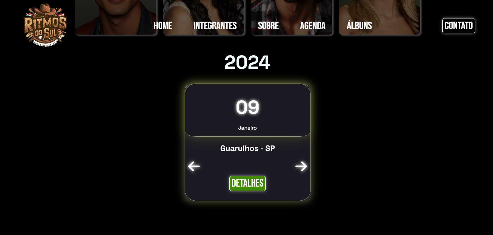
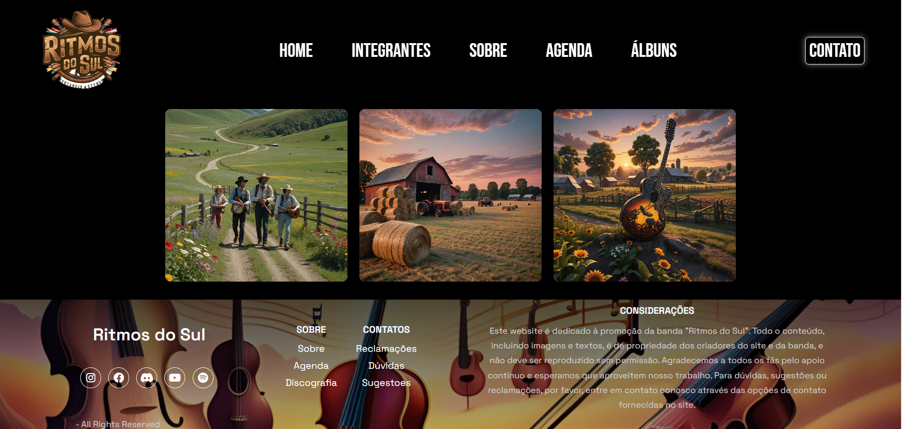
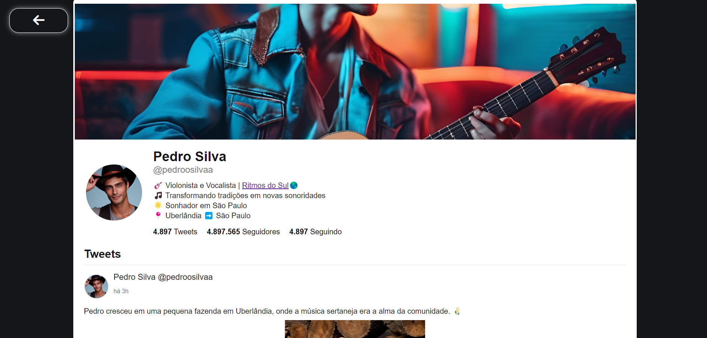

# Ritmos do Sul

Bem-vindo ao repositório do **Ritmos do Sul**! Este projeto tem como objetivo desenvolver um site para uma banda sertaneja fictícia.

## Colaboradores

Agradecimentos especiais aos colaboradores que ajudaram a criar este projeto:

    

        
        
<a href="https://github.com/GiKassime" target="_blank">João Silva</a>

    

    

        
        
<a href="https://github.com/anastoledo" target="_blank">Maria Santos</a>

    

.
## Interface do Projeto

### Página Principal

### Seção Integrantes

### Seção Sobre

### Discografia

### Twitter

## Como Executar

1. Clone o repositório.
2. Execute o projeto com liver server ou uma extensão apropiada.

