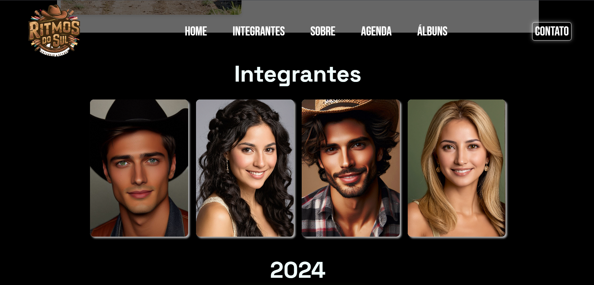

# Ritmos do Sul

Bem-vindo ao repositório do **Ritmos do Sul**! Este projeto tem como objetivo desenvolver um site para uma banda sertaneja fictícia.
Trabalho feito por
## Colaboradores

    

        
        
<a href="https://github.com/GiKassime" target="_blank">João Silva</a>

    

    

        
        
<a href="https://github.com/anastoledo" target="_blank">Maria Santos</a>

    

|  |  | 
|:---:|:---:|:---:|
| [**Colaborador1**](https://github.com/GiKassime) | [**Colaborador2**](https://github.com/anastoledo) | 

## Interface do Projeto

Página principal:

Seção Integrantes:

Seção Sobre:

Discografia:

Twitter:

## Funcionalidades

- Funcionalidade 1: Descrição da funcionalidade.
- Funcionalidade 2: Descrição da funcionalidade.
- Funcionalidade 3: Descrição da funcionalidade.

## Como Executar

1. Clone o repositório.
2. Instale as dependências usando `pip install -r requirements.txt`.
3. Execute o projeto com `python main.py`.
